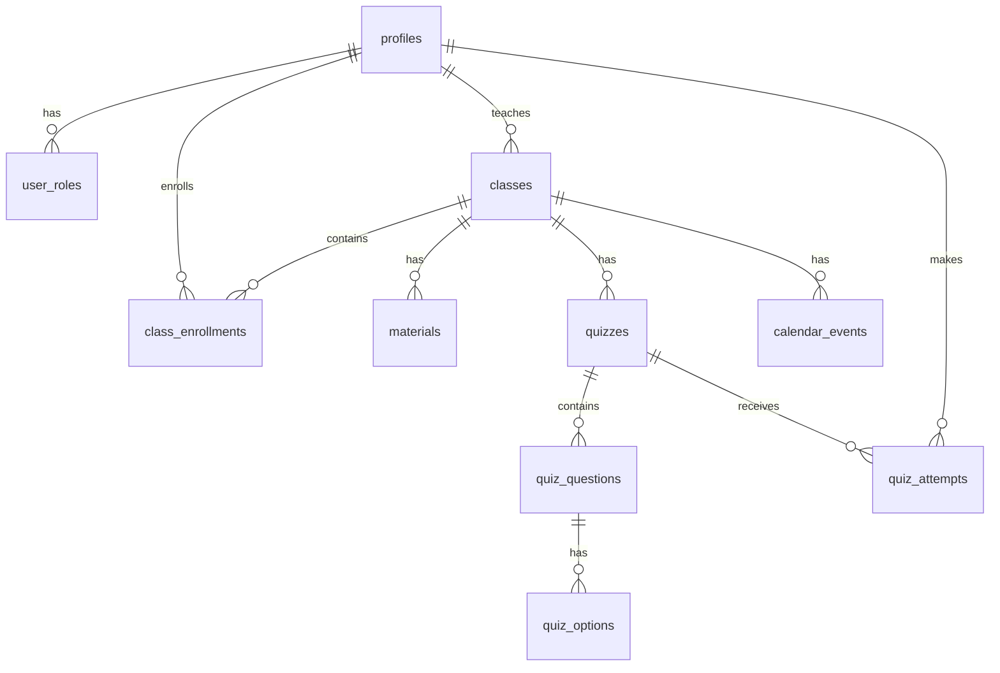

# LUMINA 🌟

> Sistema Acadêmico Colaborativo com Inteligência Artificial Integrada

[]()
[](LICENSE)
[](https://www.typescriptlang.org/)
[](https://reactjs.org/)

---

## 📋 Sobre o Projeto

**LUMINA** é uma plataforma educacional moderna que revoluciona a gestão acadêmica através da integração de Inteligência Artificial. Desenvolvido com foco em experiência do usuário e práticas modernas de engenharia de software, o sistema oferece uma solução completa para instituições de ensino, professores e alunos.

### 🎯 Destaques

- 🤖 **Assistente Virtual com IA** - Suporte inteligente para alunos e professores
- 📚 **Gestão Completa de Conteúdo** - Materiais didáticos com suporte multimídia
- 📊 **Avaliações Interativas** - Sistema de quizzes com feedback automático
- 📅 **Calendário Integrado** - Organização de eventos e atividades acadêmicas
- 🔐 **Segurança Avançada** - RLS e políticas de acesso baseadas em papéis
- 📱 **Design Responsivo** - Interface adaptativa para todos os dispositivos

---

## 🎯 Objetivos

### Objetivo Geral

Projetar e implementar um sistema acadêmico integrado que permita gerenciar turmas, alunos, aulas e atividades, com funcionalidades de colaboração, explorando práticas de engenharia de software ágil e uso de recursos de Inteligência Artificial.

### Objetivos Específicos

- ✅ Gerenciamento completo de turmas e matrículas
- ✅ Sistema de materiais didáticos com suporte a vídeos e documentos
- ✅ Criação e aplicação de quizzes avaliativos com correção automática
- ✅ Calendário acadêmico integrado com notificações
- ✅ Assistente virtual com IA para suporte aos usuários
- ✅ Interface responsiva e intuitiva com foco em acessibilidade
- ✅ Dashboard com análise de desempenho e estatísticas
- ✅ Sistema de autenticação e autorização robusto

---

## 🚀 Funcionalidades

### Para Professores

| Funcionalidade | Descrição |
|----------------|-----------|
| 👥 **Gestão de Turmas** | Criação, edição e gerenciamento completo de turmas com códigos únicos |
| 📝 **Materiais Didáticos** | Upload e organização de conteúdo com suporte a vídeos (YouTube, Vimeo) |
| 📊 **Quizzes & Avaliações** | Criação de avaliações com questões de múltipla escolha e pontuação automática |
| 📅 **Calendário Acadêmico** | Agendamento de aulas, provas e eventos com visibilidade por turma |
| 📈 **Análise de Desempenho** | Visualização de estatísticas e relatórios de progresso dos alunos |
| 🤖 **Assistente IA** | Suporte inteligente para planejamento de aulas e auxílio pedagógico |

### Para Alunos

| Funcionalidade | Descrição |
|----------------|-----------|
| 🎓 **Matrícula Simplificada** | Inscrição em turmas via código único compartilhado pelo professor |
| 📚 **Biblioteca de Materiais** | Acesso organizado a todos os conteúdos didáticos da turma |
| ✍️ **Realização de Quizzes** | Interface intuitiva para avaliações com feedback imediato |
| 📆 **Calendário Pessoal** | Visualização de todos os eventos e prazos das turmas matriculadas |
| 📊 **Dashboard Pessoal** | Estatísticas de desempenho, notas e progresso em tempo real |
| 💬 **Assistente IA** | Suporte para dúvidas, esclarecimentos e auxílio nos estudos |

---

## 💻 Tecnologias Utilizadas

### Frontend

| Tecnologia | Versão | Descrição |
|-----------|--------|-----------|
| **React** | 18.3+ | Biblioteca JavaScript para construção de interfaces |
| **TypeScript** | 5.0+ | Superset tipado do JavaScript para maior segurança |
| **Vite** | Latest | Build tool moderna e servidor de desenvolvimento rápido |
| **Tailwind CSS** | 3.0+ | Framework CSS utilitário para estilização eficiente |
| **shadcn/ui** | Latest | Coleção de componentes UI acessíveis e customizáveis |
| **React Router** | 6.0+ | Roteamento e navegação SPA |
| **TanStack Query** | 5.0+ | Gerenciamento de estado assíncrono e cache |

### Backend & Infraestrutura

| Tecnologia | Descrição |
|-----------|-----------|
| **PostgreSQL** | Banco de dados relacional robusto e escalável |
| **Edge Functions** | Funções serverless para lógica customizada |
| **Row Level Security (RLS)** | Segurança granular a nível de linha no banco |
| **Real-time Subscriptions** | Atualizações em tempo real via WebSockets |

### Inteligência Artificial

| Modelo | Uso |
|--------|-----|
| **Gemini 2.5 Flash** | Assistente virtual com respostas rápidas e eficientes |
| **GPT-5** | Funcionalidades avançadas e análise complexa |

---

## 🛠️ Instalação e Configuração

### Pré-requisitos

Certifique-se de ter instalado:

- [Node.js](https://nodejs.org/) (versão 18.0 ou superior)
- npm (incluído com Node.js) ou [Bun](https://bun.sh/)
- Git para controle de versão

### Passo a Passo

```bash
# 1. Clone o repositório
git clone <URL_DO_REPOSITORIO>

# 2. Navegue até o diretório do projeto
cd lumina

# 3. Instale as dependências
npm install
# ou com Bun
bun install

# 4. Configure as variáveis de ambiente
# O arquivo .env é gerado automaticamente com as credenciais do backend

# 5. Inicie o servidor de desenvolvimento
npm run dev
# ou com Bun
bun dev
```

O projeto estará disponível em **http://localhost:5173**

### Comandos Disponíveis

| Comando | Descrição |
|---------|-----------|
| `npm run dev` | Inicia o servidor de desenvolvimento |
| `npm run build` | Cria a build de produção |
| `npm run preview` | Preview da build de produção |
| `npm run lint` | Executa o linter para verificar o código |
| `npm run type-check` | Verifica os tipos TypeScript |

---

## 📦 Estrutura do Projeto

```
lumina/
├── public/                    # Arquivos estáticos públicos
│   ├── robots.txt            # Configuração para crawlers
│   └── favicon.ico           # Ícone do site
│
├── src/                      # Código fonte principal
│   ├── components/           # Componentes React reutilizáveis
│   │   ├── ui/              # Componentes base do shadcn/ui
│   │   ├── AppSidebar.tsx   # Navegação lateral da aplicação
│   │   ├── Navbar.tsx       # Barra de navegação principal
│   │   └── PlotTwist.tsx    # Animação de carregamento inicial
│   │
│   ├── pages/               # Páginas da aplicação (rotas)
│   │   ├── Index.tsx        # Página inicial (landing page)
│   │   ├── Home.tsx         # Home page com informações
│   │   ├── Login.tsx        # Autenticação de usuários
│   │   ├── Cadastro.tsx     # Registro de novos usuários
│   │   ├── Dashboard.tsx    # Painel principal do sistema
│   │   ├── Turmas.tsx       # Gerenciamento de turmas
│   │   ├── Materiais.tsx    # Biblioteca de materiais didáticos
│   │   ├── Quizzes.tsx      # Sistema de avaliações
│   │   ├── Calendario.tsx   # Calendário de eventos
│   │   ├── Assistente.tsx   # Assistente virtual com IA
│   │   ├── Sobre.tsx        # Informações sobre o projeto
│   │   └── NotFound.tsx     # Página 404
│   │
│   ├── integrations/        # Integrações com serviços externos
│   │   └── supabase/        # Cliente e tipos do Supabase
│   │       ├── client.ts    # Cliente configurado (auto-gerado)
│   │       └── types.ts     # TypeScript types (auto-gerado)
│   │
│   ├── hooks/               # Custom React Hooks
│   │   ├── use-mobile.tsx   # Hook para detecção de dispositivos móveis
│   │   └── use-toast.ts     # Hook para notificações toast
│   │
│   ├── lib/                 # Utilitários e helpers
│   │   └── utils.ts         # Funções auxiliares (cn, etc)
│   │
│   ├── App.tsx              # Componente raiz da aplicação
│   ├── main.tsx             # Entry point do React
│   ├── index.css            # Estilos globais e design tokens
│   └── vite-env.d.ts        # Tipos do Vite
│
├── supabase/                # Configuração do backend
│   ├── config.toml          # Configuração do Supabase (auto-gerado)
│   ├── functions/           # Edge Functions serverless
│   │   └── chat-assistant/  # Função do assistente de IA
│   └── migrations/          # Migrações do banco de dados
│
├── python-backend/          # Estrutura de referência Python (acadêmica)
│   ├── api/                 # Endpoints da API
│   ├── models/              # Modelos de dados
│   ├── services/            # Lógica de negócio
│   ├── utils/               # Utilitários
│   └── README.md            # Documentação da estrutura
│
├── .env                     # Variáveis de ambiente (auto-gerado)
├── .gitignore              # Arquivos ignorados pelo Git
├── components.json         # Configuração do shadcn/ui
├── eslint.config.js        # Configuração do ESLint
├── index.html              # HTML principal
├── package.json            # Dependências e scripts
├── tailwind.config.ts      # Configuração do Tailwind CSS
├── tsconfig.json           # Configuração do TypeScript
├── vite.config.ts          # Configuração do Vite
└── README.md               # Este arquivo
```

---

## 🗃️ Arquitetura do Banco de Dados

### Modelo de Dados



### Tabelas Principais

| Tabela | Descrição | Campos Principais |
|--------|-----------|-------------------|
| **profiles** | Perfis de usuários do sistema | id, email, full_name, avatar_url |
| **user_roles** | Papéis dos usuários (aluno/professor) | user_id, role (enum) |
| **classes** | Turmas criadas por professores | id, teacher_id, name, code, description |
| **class_enrollments** | Matrículas de alunos em turmas | student_id, class_id, enrolled_at |
| **materials** | Materiais didáticos | id, class_id, title, content, video_url |
| **quizzes** | Avaliações e questionários | id, class_id, title, is_published, time_limit |
| **quiz_questions** | Questões dos quizzes | id, quiz_id, question, points, question_order |
| **quiz_options** | Opções de resposta | id, question_id, option_text, is_correct |
| **quiz_attempts** | Tentativas de resolução | id, student_id, quiz_id, score, answers (jsonb) |
| **calendar_events** | Eventos do calendário | id, class_id, title, start_date, end_date, event_type |

### Políticas de Segurança (RLS)

O sistema implementa **Row Level Security** em todas as tabelas, garantindo que:

- 👨‍🏫 **Professores** só podem acessar e modificar recursos de suas próprias turmas
- 👨‍🎓 **Alunos** só podem visualizar conteúdo das turmas em que estão matriculados
- 🔒 **Dados sensíveis** como respostas corretas de quizzes são protegidos até após submissão
- 🛡️ **Validações** garantem integridade referencial e regras de negócio

---

## 🔐 Segurança

### Camadas de Proteção

1. **Autenticação Robusta**
   - Email e senha com criptografia bcrypt
   - Tokens JWT para sessões seguras
   - Auto-confirmação de email para desenvolvimento

2. **Autorização Granular**
   - Row Level Security (RLS) em todas as tabelas
   - Políticas baseadas em papéis (professor/aluno)
   - Funções SQL personalizadas para validação

3. **Proteção de Dados**
   - Validação de entrada no frontend e backend
   - Sanitização de dados antes de persistência
   - Proteção contra SQL Injection
   - CORS configurado adequadamente

4. **Privacidade**
   - Usuários só acessam seus próprios dados
   - Dados de turma compartilhados apenas entre membros
   - Respostas de quizzes protegidas até submissão

---

## 🎨 Design System

O projeto utiliza um design system consistente baseado em tokens semânticos:

### Paleta de Cores

```css
/* Cores principais definidas em HSL */
--primary: [Cor principal do tema]
--secondary: [Cor secundária]
--accent: [Cor de destaque]
--background: [Fundo principal]
--foreground: [Texto principal]
--muted: [Elementos discretos]
```

### Componentes UI

- Todos os componentes seguem padrões de acessibilidade WCAG 2.1
- Design responsivo mobile-first
- Animações suaves e performáticas
- Dark mode support (quando aplicável)

---

## 🚀 Deploy e Produção

### Build de Produção

```bash
# Criar build otimizada
npm run build

# Preview local da build
npm run preview
```

### Otimizações Aplicadas

- ⚡ Code splitting automático
- 🗜️ Minificação de JavaScript e CSS
- 🖼️ Otimização de imagens
- 📦 Tree shaking para redução de bundle
- 🔄 Service Worker para cache (quando aplicável)

### Variáveis de Ambiente

O arquivo `.env` é gerado automaticamente e contém:

```env
VITE_SUPABASE_URL=<url_do_backend>
VITE_SUPABASE_PUBLISHABLE_KEY=<chave_publica>
VITE_SUPABASE_PROJECT_ID=<id_do_projeto>
```

---

## 🧪 Desenvolvimento

### Boas Práticas

- ✅ Utilizar TypeScript para type safety
- ✅ Componentes pequenos e focados
- ✅ Hooks customizados para lógica reutilizável
- ✅ Nomenclatura clara e consistente
- ✅ Comentários em código complexo
- ✅ Commits semânticos e descritivos

### Estrutura de Componentes

```typescript
// Exemplo de componente bem estruturado
import { useState } from "react";
import { Button } from "@/components/ui/button";

interface MyComponentProps {
  title: string;
  onAction: () => void;
}

export const MyComponent = ({ title, onAction }: MyComponentProps) => {
  const [isLoading, setIsLoading] = useState(false);

  // Lógica do componente aqui

  return (
    <div className="container">
      <h2>{title}</h2>
      <Button onClick={onAction}>Ação</Button>
    </div>
  );
};
```

---

## 🐛 Troubleshooting

### Problemas Comuns

**Erro ao instalar dependências:**
```bash
# Limpe o cache e reinstale
rm -rf node_modules package-lock.json
npm install
```

**Erro de conexão com o backend:**
- Verifique se o arquivo `.env` existe e está configurado
- Confirme que as credenciais estão corretas
- Tente reiniciar o servidor de desenvolvimento

**Erro de TypeScript:**
```bash
# Execute verificação de tipos
npm run type-check
```

**Página em branco no navegador:**
- Verifique o console do navegador (F12) para erros
- Confirme que o servidor está rodando na porta correta
- Limpe o cache do navegador

---

## 📚 Recursos Adicionais

### Documentação das Tecnologias

- [React Documentation](https://react.dev/)
- [TypeScript Handbook](https://www.typescriptlang.org/docs/)
- [Tailwind CSS Docs](https://tailwindcss.com/docs)
- [Vite Guide](https://vitejs.dev/guide/)
- [shadcn/ui Components](https://ui.shadcn.com/)

### Referências do Projeto

- Padrões de código seguem as convenções do Airbnb JavaScript Style Guide
- Design inspirado em princípios de Material Design e Human Interface Guidelines
- Arquitetura baseada em Clean Architecture e SOLID principles

---

## 👥 Contribuição

Contribuições são bem-vindas! Para contribuir:

1. Faça um Fork do projeto
2. Crie uma branch para sua feature (`git checkout -b feature/MinhaFeature`)
3. Commit suas mudanças (`git commit -m 'Adiciona MinhaFeature'`)
4. Push para a branch (`git push origin feature/MinhaFeature`)
5. Abra um Pull Request

### Guidelines de Contribuição

- Mantenha o código limpo e bem documentado
- Siga os padrões de código existentes
- Teste suas alterações antes de submeter
- Atualize a documentação quando necessário

---

## 📝 Changelog

### v1.0.0 (2024)
- 🎉 Lançamento inicial do LUMINA
- ✅ Sistema completo de autenticação
- ✅ Gestão de turmas e matrículas
- ✅ Biblioteca de materiais didáticos
- ✅ Sistema de quizzes com avaliação automática
- ✅ Calendário acadêmico integrado
- ✅ Assistente virtual com IA
- ✅ Dashboard com estatísticas e análises

---

## 📄 Licença

Este projeto está sob a licença MIT. Veja o arquivo [LICENSE](LICENSE) para mais detalhes.

---

## 📞 Suporte

Para dúvidas, sugestões ou reportar problemas:

- 📧 Email: suporte@lumina.edu
- 🐛 Issues: Abra uma issue no repositório
- 💬 Discussões: Use a aba Discussions do GitHub

---

## 🌟 Agradecimentos

Desenvolvido com ❤️ para melhorar a experiência educacional através da tecnologia.

**LUMINA** - Iluminando o caminho do conhecimento com Inteligência Artificial.

---

<div align="center">

**[⬆ Voltar ao topo](#lumina-)**

Made with ❤️ using React, TypeScript, and Modern Web Technologies

</div>
